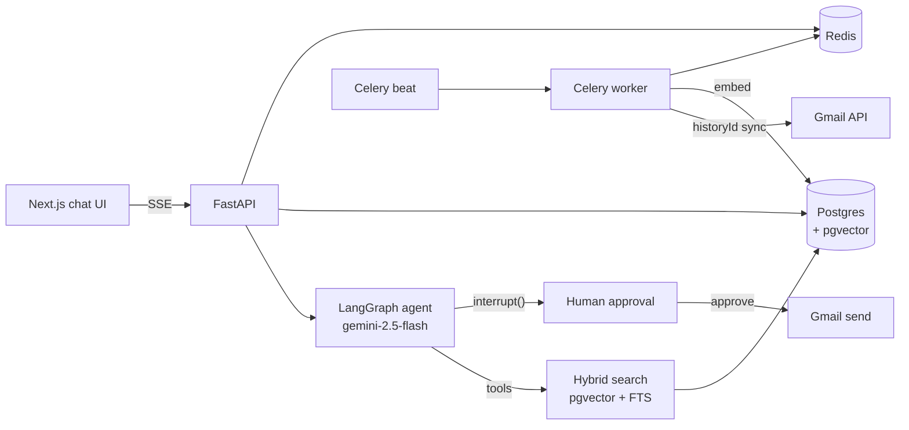

# MailMind 📬🤖

> An AI agent that turns your Gmail inbox into a queryable database — chat with your emails, extract transactions into structured data, and let the agent draft/forward emails with **human-in-the-loop approval**.

## Features

- 💬 **Chat with your inbox** — streaming answers grounded in your real emails, with citations linking back to Gmail
- 🔎 **Hybrid retrieval** — SQL metadata filters + pgvector semantic search + Postgres full-text, blended 70/30
- 💳 **Transaction extraction** — Gemini structured outputs turn bank/UPI/receipt emails into a typed table + CSV export
- ✋ **Human-approved sends** — the agent can draft/forward/send, but a LangGraph `interrupt()` pauses every send until you click Approve
- 🔄 **Incremental Gmail sync** — `historyId`-based delta sync via Celery beat, idempotent by message id
- 🔐 **Security-minded** — refresh tokens Fernet-encrypted at rest, signed session cookies, immutable action audit log

## Architecture



## Stack

| Layer | Tech |
|---|---|
| API | FastAPI (Python 3.12, uv) |
| Agent | LangChain + **LangGraph** (react agent, Postgres checkpointer, `interrupt()` HITL) |
| LLM / Embeddings | **Gemini** 2.5 Flash + text-embedding-004 (free tier) |
| Storage | Postgres 16 + **pgvector** (HNSW) + FTS (GIN) |
| Queue | **Celery** + Redis (sync every 5 min, embed every 2 min) |
| Frontend | Next.js 16 + Tailwind 4, SSE streaming chat |
| Migrations | Alembic |

Full design doc: [`docs/SPEC.md`](docs/SPEC.md)

## Quickstart

```bash
# 0. Prereqs: Docker, uv, pnpm, a Google OAuth web client + Gemini API key (see below)

# 1. Infra (Postgres + pgvector on :5433, Redis)
docker compose up -d

# 2. API
cd apps/api
cp ../../.env.example .env      # fill GOOGLE_CLIENT_ID/SECRET, GEMINI_API_KEY, SESSION_SECRET, FERNET_KEY
uv sync
uv run alembic upgrade head
uv run uvicorn app.main:app --reload            # :8000 (docs at /docs)

# 3. Workers (two more terminals, from apps/api)
uv run celery -A app.workers.celery_app worker --loglevel=info
uv run celery -A app.workers.celery_app beat --loglevel=info

# 4. UI
cd apps/web && pnpm install && pnpm dev          # :3000
```

Open http://localhost:3000 → **Connect Google account** → Sync now → chat.

### Google setup (one-time, ~10 min, free)

1. [console.cloud.google.com](https://console.cloud.google.com) → new project → enable **Gmail API**
2. OAuth consent screen: External, **Testing** mode, add yourself as test user
3. Credentials → OAuth client ID → **Web application** → redirect URI `http://localhost:8000/auth/google/callback`
4. [aistudio.google.com/apikey](https://aistudio.google.com/apikey) → Gemini API key

> The "unverified app" warning during consent is expected — it's your own app in testing mode.

## Evals

Retrieval quality is measured with Recall@5 on a golden set of real queries (`evals/golden.json`):

```bash
cd apps/api && uv run python ../../evals/run_evals.py
```

<!-- EVAL_RESULTS -->

## Development

```bash
cd apps/api
uv run pytest          # tests (needs docker compose up)
uv run ruff check .    # lint
```

## Design decisions worth reading

- **Filter-then-search**: "emails from HDFC in June" is metadata, not semantics — SQL narrows, vectors rank ([app/retrieval/hybrid.py](apps/api/app/retrieval/hybrid.py))
- **Interrupt-gated sends**: the send tool itself calls `interrupt()`; approval resumes the exact graph thread from the Postgres checkpointer ([app/agent/tools.py](apps/api/app/agent/tools.py))
- **Resumable embedding**: per-email commits + `embedded` flag mean free-tier rate limits can kill the worker mid-run with zero data loss

## Status

- [x] Phase 0 — scaffold: FastAPI + Docker infra + health checks
- [x] Phase 1 — Google OAuth + Gmail incremental sync + embeddings
- [x] Phase 2 — LangGraph agent + hybrid search + chat UI
- [x] Phase 3 — transaction extraction + CSV
- [x] Phase 4 — send/forward with human approval
- [ ] Phase 5 — evals on real inbox + demo video
